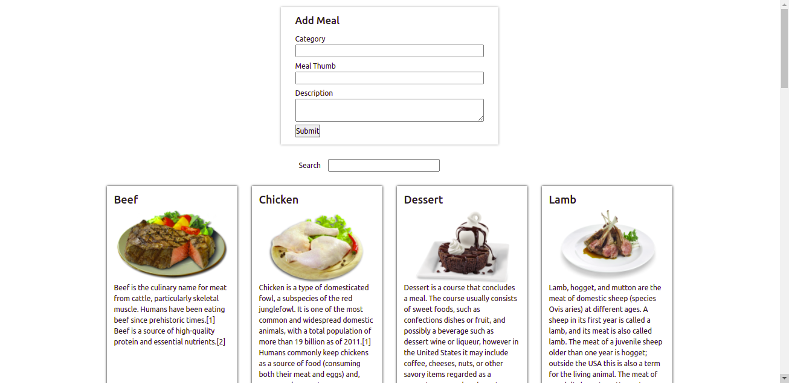

# The Hotel

## By Amos Sifuma

## Screenshot

## Table of Content

- [Description](#description)
- [Features](#features)
- [Requirements](#requirements)
- [Installation Process](#installation-Process)
- [Live Link](#Live-Link)
- [Technology Used](#technology-Used)
- [Licence](#licence)
- [Authors Info](#Authors-Info)

## Description

 
This project is a web application for The Hotel that shows details or information about a variety of meals. It has a meal info section where all the meals are, a form where a client can add a new meal, and a search bar where one can search for a meal; either by its name or by its description.

[Go Back to the top](the-hotel)

## Features
As a user of the application,you will be able to :
1. See a description of all the meals displayed 
2. Can be able to add a new meal through a form.
[Go Back to the top](the-hotel)

 ###  Requirements
 * Access to  a computer or any other gadget.
 * Access to internet

 ### Installation Process
 ****
* Clone to their repo : git clone https://github.com/AmosJune/the-hotel.git
* Unzip the downloaded files in a folder of choice.
* Open the index file from the zipped file with any browser.
 ****
 [Go Back to the top](the-hotel)

### Live Link
<!-- - Click this link to view the live application https://albert-byrone.github.io/delani/ -->

### Technology  Used
* HTML - which was used to develop the structure of the pages.
* CSS - which was used to style the User Interface.
* REACT - which was used to create reusable UI components that present data that changes over time.
[Go Back to the top](the-hotel)

## Licence
MIT License
Copyright (c) [2019] [Albert Byrone]
Permission is hereby granted, free of charge, to any person obtaining a copy
of this software and associated documentation files (the "Software"), to deal
in the Software without restriction, including without limitation the rights
to use, copy, modify, merge, publish, distribute, sublicense, and/or sell
copies of the Software, and to permit persons to whom the Software is
furnished to do so, subject to the following conditions:
The above copyright notice and this permission notice shall be included in all
copies or substantial portions of the Software.
THE SOFTWARE IS PROVIDED "AS IS", WITHOUT WARRANTY OF ANY KIND, EXPRESS OR
IMPLIED, INCLUDING BUT NOT LIMITED TO THE WARRANTIES OF MERCHANTABILITY,
FITNESS FOR A PARTICULAR PURPOSE AND NONINFRINGEMENT. IN NO EVENT SHALL THE
AUTHORS OR COPYRIGHT HOLDERS BE LIABLE FOR ANY CLAIM, DAMAGES OR OTHER
LIABILITY, WHETHER IN AN ACTION OF CONTRACT, TORT OR OTHERWISE, ARISING FROM,
OUT OF OR IN CONNECTION WITH THE SOFTWARE OR THE USE OR OTHER DEALINGS IN THE
SOFTWARE.
[Go Back to the top](the-hotel)
## Authors Info
Slack Profile - [Amos Sifuma]
[Go Back to the top](the-hotel)
